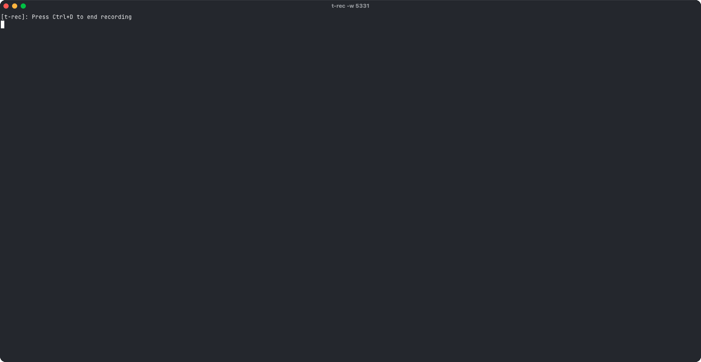

# FLI - Flow Logs Insights

[](https://goreportcard.com/report/github.com/fractalops/fli)
[](https://go.dev/)
[](https://github.com/fractalops/fli)
[](LICENSE)
[](https://github.com/fractalops/fli/releases)
[](https://github.com/fractalops/fli/graphs/contributors)

FLI is a powerful command-line tool that simplifies AWS VPC Flow Logs analysis with intuitive commands, smart filtering, and 
automatic annotations, turning raw network data into actionable insights in seconds.



## Features

- **Interactive Setup**: `fli init` discovers or creates VPC flow logs interactively
- **Profile Management**: Named profiles for multiple flow log configurations with 
- Automatic schema version detection
- **Full Lifecycle**: `fli cleanup` tears down all resources created by `fli init` with state tracking
- **Intuitive Query Language**: Simple commands like `count`, `sum`, and `raw` replace complex query syntax
- **Smart Filtering**: Filter traffic by IP, port, protocol, or any flow log field with a natural language-like syntax
- **Powerful Aggregations**: Easily identify top talkers, analyze traffic patterns, and detect anomalies
- **Rich Annotations**: Automatically enrich IPs with WHOIS data and identify cloud provider ranges
- **Multiple Output Formats**: View results as tables, CSV, or JSON for further processing
- **Cross-Platform**: Works on Linux, macOS, and Windows

## Quick Start

### Installation

**Using curl**
```bash
curl -sSL https://github.com/fractalops/fli/releases/latest/download/install.sh | bash
```

**From Source**
```bash
git clone https://github.com/fractalops/fli.git
cd fli
make build
sudo make install
```

### Setup

1. **Set up AWS credentials**:
   ```bash
   aws configure
   ```

2. **Initialize fli** (interactive wizard — discovers or creates VPC flow logs):
   ```bash
   fli init
   ```
   This will:
   - Discover existing VPC flow logs in your region
   - Let you select one, or create a new flow log with all required AWS resources (IAM role, log group)
   - Save the configuration as a named profile

3. **Or configure manually** (optional):
   ```bash
   # Set default log group directly
   export FLI_LOG_GROUP="/aws/vpc/flow-logs"
   ```

## Examples

### Security Analysis

```bash
# Find rejected traffic to sensitive ports
fli count --by srcaddr --filter "action=REJECT and (dstport=22 or dstport=3389)" --since 1h
```

Sample output:
```
+---------------+-------+
| srcaddr       | flows |
+---------------+-------+
| 203.0.113.15  | 1,245 |
| 198.51.100.72 |   982 |
| 192.0.2.101   |   657 |
+---------------+-------+
```

### Traffic Monitoring

```bash
# Identify top bandwidth consumers
fli sum bytes --by srcaddr,dstaddr --limit 10 --since 6h
```

Sample output:
```
+---------------+---------------+------------+
| srcaddr       | dstaddr       | sum_bytes  |
+---------------+---------------+------------+
| 10.0.1.5      | 10.0.2.10     | 1,245,678  |
| 10.0.3.12     | 10.0.1.200    |   982,345  |
| 10.0.2.8      | 10.0.3.15     |   657,890  |
+---------------+---------------+------------+
```

### Network Troubleshooting

```bash
# Check connectivity between specific hosts
fli raw srcaddr,dstaddr,dstport,action --filter "srcaddr=10.0.1.5 and dstaddr=10.0.2.10" --since 2h
```

Sample output:
```
+------------+------------+---------+--------+
| srcaddr    | dstaddr    | dstport | action |
+------------+------------+---------+--------+
| 10.0.1.5   | 10.0.2.10  | 443     | ACCEPT |
| 10.0.1.5   | 10.0.2.10  | 80      | ACCEPT |
| 10.0.1.5   | 10.0.2.10  | 22      | REJECT |
+------------+------------+---------+--------+
```

## More Features

### IP and ENI Annotations

```bash
# Automatically annotate ENIs and IPs
fli raw interface_id,srcaddr,dstaddr --since 1h
```

Sample output:
```
+----------------------------------+---------------+----------------------------------+
| interface_id                     | srcaddr       | dstaddr                          |
+----------------------------------+---------------+----------------------------------+
| eni-01234567 [api-server-sg]     | 10.0.1.5      | 203.0.113.10 [ACME Corp (US)]    |
| eni-89abcdef [worker-node-sg]    | 172.16.0.10   | 54.239.28.85 [Amazon AWS (US)]   |
| eni-12345abc [db-sg]             | 192.168.1.100 | 8.8.8.8 [Google LLC (US)]        |
+----------------------------------+---------------+----------------------------------+
```

### Cloud Provider Detection

```bash
# Identify traffic to/from major cloud providers
fli count --by dstaddr --filter "pkt_dst_aws_service = 'S3'" --since 1h --version 5
```

Sample output:
```
+----------------------------------+-------+
| dstaddr                          | flows |
+----------------------------------+-------+
| 54.239.28.85 [S3]                | 1,245 |
| 52.94.133.131 [S3]               |   982 |
| 52.94.8.16 [S3]                  |   657 |
+----------------------------------+-------+
```

### Advanced Filtering

```bash
# Complex filtering with multiple conditions
fli raw --filter "(srcaddr=10.0.0.0/8 and dstport=443) or (protocol=UDP and bytes>1000)" --since 3h
```

## Common Commands

### Query Commands

```bash
# Raw data query
fli raw [fields] [flags]

# Count flows
fli count [fields] [flags]

# Sum numeric fields
fli sum <field> [flags]

# Average numeric fields
fli avg <field> [flags]

# Find minimum values
fli min <field> [flags]

# Find maximum values
fli max <field> [flags]
```

### Setup Commands

```bash
# Interactive setup — discover or create VPC flow logs
fli init

# Create with a named profile
fli init --profile security

# Check required IAM permissions before setup
fli init --check-permissions

# Use plain prompts instead of TUI (for CI or screen readers)
fli init --no-tui
```

### Cleanup Commands

```bash
# Delete AWS resources created by fli init
fli cleanup

# Clean up a specific profile
fli cleanup --profile security

# Keep the log group (preserve historical data)
fli cleanup --keep-logs

# Skip confirmation prompt
fli cleanup --force

# Clean up all profiles
fli cleanup --all
```

### Profile Commands

```bash
# List all profiles
fli profile list

# Set the active profile
fli profile use security

# Show profile details and managed resources
fli profile show security

# Remove a profile from config (does not delete AWS resources)
fli profile delete security
```

### Cache Commands

```bash
# Refresh ENI tags in the cache using AWS
fli cache refresh [--eni <eni-id>] [--all]

# List cached items
fli cache list

# Update cloud provider IP ranges
fli cache prefixes

# Delete the cache file
fli cache clean
```

## Common Flags

```bash
--profile          # Named profile to use (see "fli profile list")
--log-group, -l    # CloudWatch Logs group to query (overrides profile)
--since, -s        # Relative time range (e.g., 30m, 2h, 1h)
--filter, -f       # Filter expression
--by               # Group by fields (comma-separated)
--limit            # Limit number of results (default: 20)
--format, -o       # Output format: table, csv, json (default: table)
--version, -v      # Flow logs version: 2 or 5 (default: 2, auto-set by profile)
--timeout, -t      # Query timeout (e.g., 30s, 5m, 1h)
```

Log group resolution order: `--log-group` flag > `--profile` flag > `FLI_LOG_GROUP` env > active profile > `default` profile.

## Output Formats

### Table Format (Default)
```
+---------------+-------+
| srcaddr       | flows |
+---------------+-------+
| 10.0.1.5      | 1,245 |
| 172.16.0.10   |   982 |
| 192.168.1.100 |   657 |
+---------------+-------+
```

### CSV Format
```csv
srcaddr,flows
10.0.1.5,1245
172.16.0.10,982
192.168.1.100,657
```

### JSON Format
```json
[
  {"srcaddr": "10.0.1.5", "flows": 1245},
  {"srcaddr": "172.16.0.10", "flows": 982},
  {"srcaddr": "192.168.1.100", "flows": 657}
]
```

## Autocompletion

FLI provides intelligent autocompletion for commands, flags, fields, and filter expressions to enhance your productivity.

### Setup

#### Bash
```bash
# Generate bash completion script
fli completion bash > ~/.local/share/bash-completion/completions/fli

# Or add to your ~/.bashrc
echo 'source <(fli completion bash)' >> ~/.bashrc
source ~/.bashrc
```

#### Zsh
```bash
# Generate zsh completion script
fli completion zsh > ~/.zsh/completions/_fli

# Or add to your ~/.zshrc
echo 'source <(fli completion zsh)' >> ~/.zshrc
source ~/.zshrc
```

#### Fish
```bash
# Generate fish completion script
fli completion fish > ~/.config/fish/completions/fli.fish
```

#### PowerShell
```powershell
# Generate PowerShell completion script
fli completion powershell > fli.ps1

# Import the script
. .\fli.ps1
```

## Filtering Examples

```bash
# Filter by IP address
fli raw --filter "srcaddr=10.0.0.1"

# Filter by port
fli raw --filter "dstport=443"

# Filter by action
fli raw --filter "action=REJECT"

# Multiple conditions
fli raw -f "srcaddr=10.0.0.1 and dstport=443 and action=ACCEPT"

# CIDR blocks
fli count --by srcaddr -f "dstaddr=10.0.0.0/24"

# Port ranges
fli raw -f "dstport >= 80 and dstport <= 443"

# Protocol filtering
fli count --by dstport --filter "protocol=TCP"
```

## Requirements

- **Go**: 1.22+ (for building from source)
- **AWS**: Account with VPC Flow Logs enabled
- **Permissions**: CloudWatch Logs read access
- **Platform**: Linux, macOS, or Windows

## AWS Permissions

### Querying (all users)

- `logs:StartQuery`, `logs:GetQueryResults`, `logs:StopQuery` — query flow logs
- `ec2:DescribeNetworkInterfaces`, `ec2:DescribeTags` — ENI metadata for cache

### `fli init` (setup)

- `ec2:DescribeFlowLogs` — discover existing flow logs
- `ec2:DescribeVpcs`, `ec2:DescribeSubnets` — resource selection
- `ec2:CreateFlowLogs`, `ec2:CreateTags` — create flow log
- `iam:CreateRole`, `iam:PutRolePolicy`, `iam:PassRole` — create IAM role for log publishing
- `logs:PutRetentionPolicy`, `logs:DescribeLogGroups` — configure log group
- `sts:GetCallerIdentity` — verify credentials

### `fli cleanup` (teardown)

- `ec2:DeleteFlowLogs` — delete flow log
- `iam:DeleteRolePolicy`, `iam:DeleteRole` — delete IAM role
- `logs:DeleteLogGroup` — delete log group

## Documentation

- [CLI Specification](docs/user/cli-specification.md)
- [Annotations System](docs/user/annotations.md)
- [Architecture](docs/design/architecture.md)
- [Init/Cleanup/Profile Spec](docs/design/init-cleanup-spec.md)
- [UI Refresh Spec](docs/design/ui-refresh-spec.md)

## License

This project is licensed under the MIT License - see the [LICENSE](LICENSE) file for details.

## Acknowledgments

- [AWS SDK for Go](https://github.com/aws/aws-sdk-go-v2) for AWS integration
- [Cobra](https://github.com/spf13/cobra) for the CLI framework
- [BBolt](https://github.com/etcd-io/bbolt) for embedded caching
- [WHOIS](https://github.com/likexian/whois) for IP address annotation
- [Huh](https://github.com/charmbracelet/huh) for interactive terminal forms
- [Lip Gloss](https://github.com/charmbracelet/lipgloss) for terminal styling
