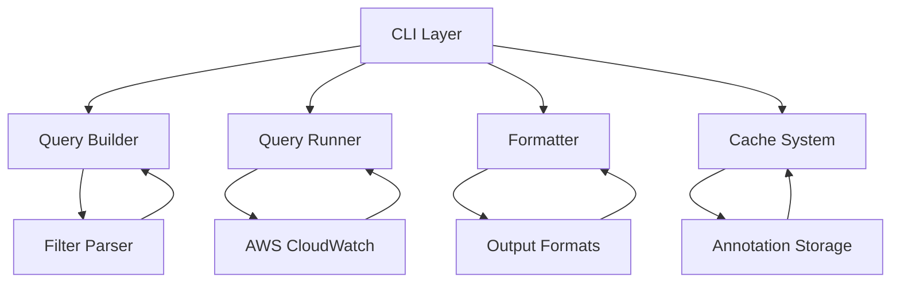
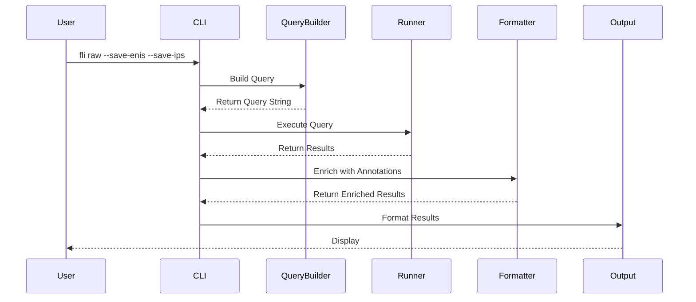

# FLI System Architecture

This document provides a comprehensive overview of FLI's system architecture, covering all major components and their interactions.

## Overview

FLI follows a modular architecture with clear separation of concerns:



## 1. CLI Architecture

### Component Structure

The CLI system provides:
- Command parsing and execution using Cobra
- Flag handling and validation
- Query execution and result formatting
- Cache and annotation integration
- Result enrichment with contextual information

### Command Hierarchy

```
fli/
├── raw     # Raw flow log entries
├── count   # Count aggregations
├── sum     # Sum numeric fields
├── avg     # Average calculations
├── min     # Minimum values
├── max     # Maximum values
└── cache/
    ├── refresh  # Update ENI annotations
    ├── prefixes # Fetch cloud provider IP ranges
    ├── list     # Show cache contents
    └── clean    # Clear cache
```

### Implementation Details

#### Command Structure
```go
type CommandFlags struct {
    // Common flags
    DryRun     bool
    Debug      bool
    UseColor   bool
    NoPtr      bool
    ProtoNames bool

    // Query-specific flags
    Limit    int
    Format   string
    Since    time.Duration
    Filter   string
    By       string
    SaveENIs bool
    SaveIPs  bool

    // AWS-specific flags
    LogGroup     string
    Version      int
    QueryTimeout time.Duration
}
```

#### Query Execution Flow


#### Default Values
- **Log Group**: Empty (required flag, can be set via FLI_LOG_GROUP env var)
- **Version**: 2 (VPC Flow Logs format)
- **Limit**: 20 results
- **Format**: table
- **Since**: 5 minutes
- **Query Timeout**: 5 minutes
- **Cache Path**: `~/.fli/cache/anno.db`

## 2. Query Builder

### Overview

The query builder provides type-safe construction of CloudWatch Logs Insights queries with support for VPC Flow Log versions 2 and 5.

### Core Components

#### Schema System
```go
type Schema interface {
    GetParsePattern(version int) (string, error)
    ValidateField(field string, version int) error
    ValidateVersion(version int) error
    GetDefaultVersion() int
    IsNumeric(field string) bool
    GetComputedFieldExpression(field string, version int) string
}

type VPCFlowLogsSchema struct {
    // Implements Schema interface for VPC Flow Logs
}
```

#### Builder Pattern
```go
type Builder struct {
    verb    Verb
    fields  []string
    groupBy []string
    limit   int
    filters []Expr
    version int
    schema  Schema
}
```

### Query Construction Process

1. **Parse Clause Generation**
   ```insights
   parse @message "* * * * * * * * * * * * * *" as version, account_id, interface_id, srcaddr, dstaddr, srcport, dstport, protocol, packets, bytes, start, end, action, log_status
   ```

2. **Filter Integration**
   - User filters are parsed and validated using schema-aware parser
   - Filters are combined with AND logic
   - Inserted after parse clause

3. **Stats Generation**
   - Based on verb (count, sum, avg, min, max)
   - Includes grouping if specified
   - Adds sorting and limits

### Verb-to-Insights Mapping

| Verb | Pattern | Generated Query |
|------|---------|-----------------|
| count | `count flows` | `stats count(*) as flows` |
| count | `count <field>` | `stats count(*) as flows by <field> \| sort flows desc` |
| sum/avg/min/max | `verb <field>` | `stats verb(field) as verb_field` |
| sum/avg/min/max | `verb <field> --by x` | `stats verb(field) as verb_field by x \| sort verb_field desc` |

### Computed Fields

The schema supports computed fields that are generated as CloudWatch Logs Insights expressions:
- **Protocol Names**: Convert protocol numbers to names (TCP, UDP, etc.)
- **Time Calculations**: Duration calculations between start and end times
- **Custom Expressions**: Complex field calculations

## 3. Filter System

### Filter Grammar

Filters use a domain-specific language (DSL) for expressing conditions:

```ebnf
filter-expr    = condition { "and" | "or" condition } ;
condition      = field operator value ;
field          = identifier ;
operator       = "=" | "!=" | ">" | "<" | ">=" | "<=" | "like" | "between" ;
value          = string | number | boolean | "null" ;
```

### Supported Operators

| Operator | Description | Example |
|----------|-------------|---------|
| `=` | Equality | `srcaddr=10.0.0.1` |
| `!=` | Inequality | `action!=REJECT` |
| `>` | Greater than | `bytes>1000` |
| `<` | Less than | `packets<10` |
| `>=` | Greater than or equal | `dstport>=80` |
| `<=` | Less than or equal | `srcport<=1024` |
| `like` | Pattern matching | `srcaddr like "10"` |
| `between` | Range | `dstport between 80 and 443` |

### Filter Parsing

1. **Lexical Analysis**: Tokenize filter expression
2. **Syntax Analysis**: Parse into abstract syntax tree
3. **Semantic Analysis**: Validate field names and types against schema
4. **Code Generation**: Generate CloudWatch Logs Insights filter

### Advanced Features

- **CIDR Support**: `srcaddr=10.0.0.0/24`
- **Port Ranges**: `dstport between 80 and 443`
- **Protocol Names**: `protocol=TCP` (converted to numbers)
- **Complex Logic**: `srcaddr=10.0.0.1 and dstport=443 or action=REJECT`
- **Schema Validation**: Field existence and type checking

## 4. Query Execution (Runner)

### Overview

The runner handles query execution against AWS CloudWatch Logs Insights with proper error handling and result processing.

### Execution Flow

```go
func (r *Runner) Run(ctx context.Context, query, logGroup string, start, end int64) ([][]Field, error) {
    // 1. Start query
    startResp, err := r.Client.StartQuery(ctx, &cloudwatchlogs.StartQueryInput{
        LogGroupIdentifiers: []string{logGroup},
        QueryString:         &query,
        StartTime:           &start,
        EndTime:             &end,
    })
    
    // 2. Poll for completion with exponential backoff
    results, err := r.pollResults(ctx, startResp.QueryId)
    
    // 3. Process results
    return r.processResults(results), nil
}
```

### Query Lifecycle

1. **Query Start**
   - Submit query to CloudWatch Logs Insights
   - Receive query ID

2. **Status Polling**
   - Poll query status every 500ms initially
   - backoff up to 10 seconds
   - Handle timeout and cancellation via context

3. **Result Processing**
   - Parse raw results into structured format
   - Handle field mapping and type conversion
   - Apply result limits and sorting

### Error Handling

- **Query Failures**: Proper error propagation with enhanced error messages
- **Timeout Handling**: Context cancellation support
- **Rate Limiting**: Respect AWS API limits
- **Invalid Results**: Graceful degradation
- **AWS Credential Issues**: Detailed error messages for common credential problems

### Field Structure

```go
type Field struct {
    Name  string // Field name
    Value string // Field value as string
}
```

## 5. Output Formatting

### Formatter Architecture

The formatter system provides multiple output formats with consistent result processing:

```go
type FormatOptions struct {
    Format        string
    Colorize      bool
    RemovePtr     bool
    UseProtoNames bool
    Debug         bool
}

// Format formats the results according to the specified options
func Format(results [][]runner.Field, headers []string, options FormatOptions) (string, error) {
    // Select formatter based on options.Format
    // Apply formatting and return result
}
```

### Supported Formats

#### Table Format
```
| srcaddr (api-server) | dstaddr (CLOUDFLARE) | action |
|---------------------|---------------------|--------|
| 10.0.1.10          | 1.1.1.1            | ACCEPT |
```

#### CSV Format
```csv
srcaddr,dstaddr,action
"10.0.1.10 (api-server)","1.1.1.1 (CLOUDFLARE)",ACCEPT
```

#### JSON Format
```json
[
  {
    "srcaddr": "10.0.1.10 (api-server)",
    "dstaddr": "1.1.1.1 (CLOUDFLARE)",
    "action": "ACCEPT"
  }
]
```

### Result Enrichment Pipeline

1. **Protocol Resolution**: Convert protocol numbers to names
2. **Annotation Enrichment**: Add ENI and IP annotations

### Colorization

- **ACCEPT Actions**: Green color
- **REJECT Actions**: Red color

### Protocol Mapping

The formatter automatically converts protocol numbers to their corresponding names:

- 1: ICMP
- 6: TCP
- 17: UDP
- 41: IPv6
- 47: GRE
- 50: ESP
- 51: AH
- 58: ICMPv6
- 89: OSPF
- 103: PIM
- 112: VRRP

## 6. Caching System

### Overview

The caching system provides persistent storage for annotations and metadata to enhance query results with meaningful context using BBolt database.

### Cache Architecture

```go
type Cache struct {
    db     *bbolt.DB
    logger Logger
    config *Config
}

type ENITag struct {
    ENI        string
    Label      string
    SGNames    []string
    PrivateIPs []string
    FirstSeen  int64
}

type IPTag struct {
    Addr string
    Name string
}
```

### Cache Operations

#### ENI Caching
- **Storage**: Security group names and metadata
- **Lookup**: Interface ID to human-readable name
- **Refresh**: AWS API integration for current data

#### IP Caching
- **Storage**: WHOIS data and cloud provider information
- **Lookup**: IP address to service/region information
- **Sources**: WHOIS databases, cloud provider public prefixes
- **Enrichment**: Automatic IP annotation during query execution


### Cache Commands

- **refresh**: Update ENI tags using AWS API (with --eni or --all flags)
- **prefixes**: Fetch and update cloud provider IP ranges
- **list**: Display cache contents
- **clean**: Remove cache database

### Cache Path

The default cache path is `~/.fli/cache/anno.db`, which can be overridden with the `--cache` flag for cache-related commands.

## 7. AWS Integration

### CloudWatch Logs Insights

#### Query Execution
```go
type CloudWatchLogsClient interface {
    StartQuery(ctx context.Context, params *cloudwatchlogs.StartQueryInput) (*cloudwatchlogs.StartQueryOutput, error)
    GetQueryResults(ctx context.Context, params *cloudwatchlogs.GetQueryResultsInput) (*cloudwatchlogs.GetQueryResultsOutput, error)
}
```

### EC2 Integration

The cache system integrates with EC2 API to fetch ENI metadata:

```go
type EC2Client interface {
    DescribeNetworkInterfaces(ctx context.Context, eniIDs []string) ([]aws.ENIDetails, error)
}
```

### Environment Variables

The CLI supports the following environment variables:
- `FLI_LOG_GROUP`: Default log group to query
