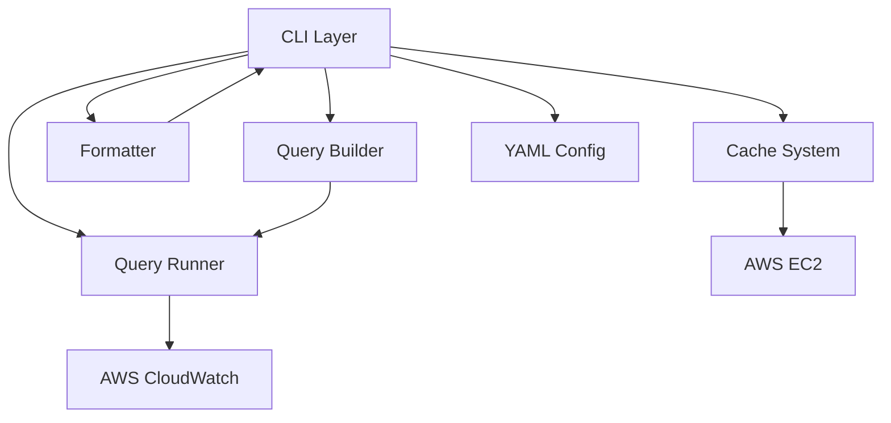

# FLI Architecture

This document provides an architectural overview of FLI's design, focusing on system components, interfaces, and data flow.

## System Overview

FLI (Flow Log Insights) is a command-line tool designed to analyze AWS VPC Flow Logs using CloudWatch Logs Insights. It provides an intuitive interface for querying, analyzing, and visualizing network traffic data.



## Core Components

### 1. Command Line Interface

The CLI layer provides a user-friendly interface for interacting with VPC Flow Logs data:

- **Command Structure**: Hierarchical command structure using verbs (raw, count, sum, avg, min, max)
- **Flag System**: Consistent flag handling across commands
- **Configuration**: Support for environment variables and YAML configurations

#### Key Interfaces

```go
// Command execution pattern
func runVerb(verb querybuilder.Verb) func(cmd *cobra.Command, args []string) error

// Query execution
func executeQuery(ctx context.Context, cmd *cobra.Command, opts []querybuilder.Option, flags *CommandFlags) ([][]interface{}, runner.QueryStatistics, error)
```

#### Key Data Structures

```go
// CommandFlags holds all the flags for the CLI commands
type CommandFlags struct {
    // Common flags
    DryRun     bool
    Debug      bool
    UseColor   bool
    
    // Query-specific flags
    Limit    int
    Format   string
    Since    time.Duration
    Filter   string
    By       string
    
    // AWS-specific flags
    LogGroup     string
    Version      int
    QueryTimeout time.Duration
}
```

#### Configuration Options

- **Log Group**: Target CloudWatch Logs group (required)
- **Time Window**: Period to analyze (--since flag, defaults to 5m)
- **Output Format**: Table, CSV, or JSON (--format flag)
- **Filter Expression**: SQL-like filter syntax (--filter flag)
- **Group By**: Fields to group results by (--by flag)

### 2. Query Building System

The query builder transforms user-friendly CLI commands into CloudWatch Logs Insights queries:

- **Schema-Aware**: Validates fields against VPC Flow Logs schema
- **Filter Support**: Parses and validates filter expressions
- **Aggregation**: Supports various aggregation operations

#### Key Interfaces

```go
// Schema interface defines how field validation works
type Schema interface {
    GetParsePattern(version int) (string, error)
    ValidateField(field string, version int) error
    ValidateVersion(version int) error
    GetDefaultVersion() int
    IsNumeric(field string) bool
    GetComputedFieldExpression(field string, version int) string
}

// Builder creates CloudWatch Logs Insights queries
func New(schema Schema, opts ...Option) (*Builder, error)
func (b *Builder) String() string
```

#### Key Data Structures

```go
// AggregationField represents a field with its aggregation verb
type AggregationField struct {
    Field string
    Verb  Verb
}

// Option configures a Builder
type Option func(*Builder) error
```

### 3. Query Execution System

The runner executes queries against AWS CloudWatch Logs Insights:

- **Asynchronous Execution**: Handles long-running queries
- **Status Polling**: Polls for query completion with backoff
- **Result Processing**: Transforms raw results into structured data

#### Key Interfaces

```go
// CloudWatchLogsClient interface for AWS interactions
type CloudWatchLogsClient interface {
    StartQuery(ctx context.Context, params *cloudwatchlogs.StartQueryInput, optFns ...func(*cloudwatchlogs.Options)) (*cloudwatchlogs.StartQueryOutput, error)
    GetQueryResults(ctx context.Context, params *cloudwatchlogs.GetQueryResultsInput, optFns ...func(*cloudwatchlogs.Options)) (*cloudwatchlogs.GetQueryResultsOutput, error)
}

// Runner executes queries
func (r *Runner) Run(ctx context.Context, logGroup string, query string, start, end int64) (QueryResult, error)
```

#### Key Data Structures

```go
// Field represents a single field in a query result
type Field struct {
    Name  string
    Value string
}

// QueryResult contains the results and statistics of a query execution
type QueryResult struct {
    Results    [][]Field
    Statistics QueryStatistics
}

// QueryStatistics represents statistics about a query execution
type QueryStatistics struct {
    BytesScanned   int64
    RecordsScanned int64
    RecordsMatched int64
}
```

### 4. Formatting System

The formatter transforms query results into user-friendly output:

- **Multiple Formats**: Supports table, CSV, and JSON output
- **Enrichment**: Adds context to results (ENI names, IP information)
- **Colorization**: Enhances readability with color-coded output

#### Key Interfaces

```go
// Format results according to options
func Format(results [][]runner.Field, headers []string, options FormatOptions) (string, error)

// Format results with statistics
func FormatWithStats(results [][]runner.Field, headers []string, options FormatOptions, stats runner.QueryStatistics) (string, error)

// Enrich results with annotations
func EnrichResultsWithAnnotations(results [][]runner.Field, cachePath string) ([][]runner.Field, error)
```

#### Key Data Structures

```go
// FormatOptions configures the formatter
type FormatOptions struct {
    Format        string
    Colorize      bool
    RemovePtr     bool
    UseProtoNames bool
    Debug         bool
}
```

### 5. Caching System

The cache provides persistent storage for annotations and metadata:

- **ENI Metadata**: Maps interface IDs to human-readable names
- **IP Information**: Stores WHOIS and cloud provider information
- **Persistence**: Maintains data between runs using BBolt database

#### Key Interfaces

```go
// Cache operations
func Open(path string) (*Cache, error)
func (c *Cache) Close() error
func (c *Cache) RefreshENIs(ctx context.Context, ec2Client EC2Client, eniIDs []string) error
func (c *Cache) RefreshAllENIs(ctx context.Context, ec2Client EC2Client) error
func (c *Cache) EnrichIPs() error
```

#### Key Data Structures

```go
// ENITag stores information about an ENI
type ENITag struct {
    ENI        string
    Label      string
    SGNames    []string
    PrivateIPs []string
    FirstSeen  int64
}

// IPTag stores information about an IP address
type IPTag struct {
    Addr      string
    Name      string
    Provider  string
    Service   string
    Region    string
    FirstSeen int64
}
```

### 6. Configuration System

The configuration system supports YAML-based query definitions:

- **Single Queries**: Define individual queries with parameters
- **Query Collections**: Group related queries together
- **Metadata**: Add names, descriptions, and tags to queries

#### Key Interfaces

```go
// Execute a query configuration
func executeQueryConfig(cmd *cobra.Command, config QueryConfig) error

// Execute a query collection
func executeQueryCollection(cmd *cobra.Command, collection QueryCollection) error
```

#### Key Data Structures

```go
// QueryConfig represents a single query configuration
type QueryConfig struct {
    Verb         string
    Fields       []string
    LogGroup     string
    Since        time.Duration
    Filter       string
    By           string
    Limit        int
    Version      int
    Format       string
    Name         string
    Description  string
    Tags         []string
}

// QueryCollection represents a collection of queries
type QueryCollection struct {
    Queries []EnhancedQueryConfig
}
```

## Error Handling Strategy

FLI implements a comprehensive error handling strategy:

1. **User-Facing Errors**: Clear, actionable error messages for common issues
   ```
   Error: log group is required
   Error: invalid filter expression: field 'invalid_field' not found in schema
   ```

2. **AWS API Errors**: Translated to meaningful messages
   ```
   Error: failed to start query: log group '/aws/vpc/flow-logs' not found
   Error: query execution failed: insufficient permissions
   ```

3. **Graceful Degradation**: Non-critical failures don't stop execution
   ```
   Warning: Failed to enrich results with annotations: cache not found
   ```

4. **Context Cancellation**: Proper handling of timeouts and interrupts
   ```
   Error: query cancelled by context: context deadline exceeded
   ```

## Component Interactions

### Query Execution Flow


### Cache Refresh Flow


## Configuration Examples

### Single Query Configuration

```yaml
verb: count
fields: [srcaddr, dstaddr]
log_group: /aws/vpc/flow-logs
since: 1h
filter: "bytes > 1000"
by: dstport
limit: 20
version: 2
format: table
name: "Large Transfers"
description: "Identify large data transfers"
tags: [security, monitoring]
```

### Query Collection

```yaml
queries:
  - name: "HTTPS Traffic"
    description: "Monitor HTTPS traffic"
    tags: [security, web]
    config:
      verb: count
      log_group: /aws/vpc/flow-logs
      since: 1h
      filter: "dstport = 443"
      by: srcaddr
      limit: 10
  
  - name: "Rejected Traffic"
    description: "Monitor rejected connections"
    tags: [security]
    config:
      verb: count
      log_group: /aws/vpc/flow-logs
      since: 1h
      filter: "action = 'REJECT'"
      by: srcaddr,dstport
      limit: 10
```

## Extension Points

FLI is designed with several extension points:

1. **New Query Verbs**: Add new query types by implementing the verb pattern
2. **Custom Formatters**: Add new output formats by implementing the formatter interface
3. **Additional Annotations**: Extend the cache with new annotation types
4. **Schema Versions**: Support new VPC Flow Log versions by updating the schema

## AWS Integration

FLI integrates with AWS services through the AWS SDK:

- **CloudWatch Logs**: Executes Logs Insights queries
- **EC2**: Retrieves ENI metadata for annotations
- **Credentials**: Uses standard AWS credential chain
- **Region**: Respects AWS_REGION environment variable

## Performance Considerations

1. **Query Optimization**:
   - Time window restrictions to limit data scanned
   - Field selection to reduce data transfer
   - Aggregations performed in CloudWatch rather than client-side

2. **Caching Strategy**:
   - Persistent cache for ENI and IP annotations
   - Cache refresh commands for updating metadata
   - Automatic enrichment of query results

3. **Backoff Strategy**:
   - Initial poll interval of 500ms
   - Exponential backoff up to configurable maximum
   - Long-running query notifications
